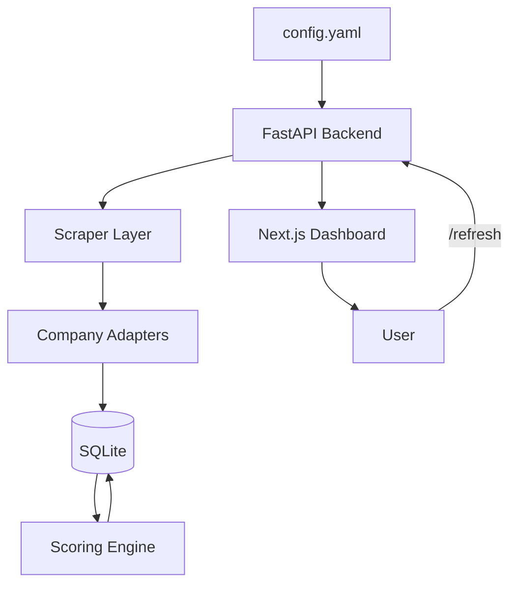

# Design Document

## Overview

The Job Role Matcher is a single-user system that automates discovery and evaluation of senior leadership roles from target industrial companies. The architecture follows a simple pipeline: scrape → normalize → score → serve. The system runs as a FastAPI backend with a Next.js frontend, using SQLite for persistence and YAML for configuration.

**Key Design Principles:**
- Single-user, localhost deployment (no multi-tenancy)
- Config-driven targeting (companies, keywords, weights)
- Fail-safe scraping (one adapter failure doesn't break others)
- Deterministic scoring with explainable results
- Minimal UI ceremony (table + detail view)

## Architecture



**Component Flow:**
1. User triggers /refresh or cron hits /refresh
2. Scraper loads config, runs each company adapter independently
3. Adapters fetch jobs, extract external_id, title, location, description
4. Normalizer writes/updates JobPosting rows (dedup on company_id + external_id)
5. Scorer reads active jobs, extracts signals, calculates dimension scores
6. Scorer writes Evaluation rows with score, action, concerns, summary
7. Frontend queries /jobs, displays ranked table
8. User clicks row, sees /jobs/{id} detail view


## Components and Interfaces

### 1. Configuration Module

**File:** `config.yaml`

**Structure:**
```yaml
admin_token: "your-secret-token-here"

companies:
  - name: "Siemens"
    careers_url: "https://jobs.siemens.com/api/jobs"
    adapter: "siemens"
  - name: "Bosch"
    careers_url: "https://www.bosch.com/careers/"
    adapter: "bosch"
  # ... additional companies

seniority_keywords:
  - "Director"
  - "Senior Director"
  - "Sr Director"
  - "VP"
  - "Vice President"
  - "Head"
  - "GM"
  - "Managing Director"

domain_keywords:
  - "Transformation"
  - "Digital"
  - "Innovation"
  - "Advanced Manufacturing"
  - "Industrial AI"
  - "Enterprise Architecture"
  - "Electrification"
  - "Energy Storage"
  - "Battery"
  - "IoT"
  - "ERP"
  - "Industry 4.0"

geography:
  preferred:
    - "Mexico"
    - "Texas"
    - "Remote"
    - "LATAM"
    - "North America"
  banned:
    - "China relocation"
    - "Germany on-site only"

scoring_weights:
  seniority: 30
  pnl: 20
  transformation: 20
  industry: 20
  geo: 10
  banned_penalty: 10
```

**Interface:**
```python
from pydantic import BaseModel, Field
from typing import List

class GeographyConfig(BaseModel):
    preferred: List[str]
    banned: List[str]

class ScoringWeights(BaseModel):
    seniority: int = 30
    pnl: int = 20
    transformation: int = 20
    industry: int = 20
    geo: int = 10
    banned_penalty: int = 10

class CompanyConfig(BaseModel):
    name: str
    careers_url: str
    adapter: str

class Config(BaseModel):
    admin_token: str
    companies: List[CompanyConfig]
    seniority_keywords: List[str]
    domain_keywords: List[str]
    geography: GeographyConfig
    scoring_weights: ScoringWeights

def load_config(path: str = "config.yaml") -> Config:
    """
    Load and validate configuration from YAML file.
    Uses Pydantic for schema validation to catch typos.
    Loaded once at startup, not per request.
    """
    with open(path) as f:
        data = yaml.safe_load(f)
    return Config(**data)
```


### 2. Scraper Layer

**Responsibility:** Fetch raw job postings from each company's careers system.

**Base Adapter Interface:**
```python
class BaseAdapter:
    def __init__(self, company: CompanyConfig):
        self.company = company
    
    def fetch_jobs(self) -> List[RawJobPosting]:
        """
        Fetch jobs from company careers system.
        Returns list of raw job postings.
        Raises AdapterError if fetch fails.
        """
        raise NotImplementedError

class RawJobPosting:
    external_id: str      # Company's requisition ID
    title: str
    location: str
    department: Optional[str]
    description: str      # Full text
    url: str
    partial_description: bool = False
```

**Adapter Registry:**
```python
ADAPTERS = {
    "siemens": SiemensAdapter,
    "bosch": BoschAdapter,
    "abb": ABBAdapter,
    # ... one adapter per company
}

def get_adapter(company: CompanyConfig) -> BaseAdapter:
    adapter_class = ADAPTERS.get(company.adapter)
    if not adapter_class:
        raise ValueError(f"Unknown adapter: {company.adapter}")
    return adapter_class(company)
```

**Scraper Runner:**
```python
from concurrent.futures import ThreadPoolExecutor, TimeoutError as FuturesTimeoutError
import logging

logger = logging.getLogger(__name__)

class ScraperRunner:
    def __init__(self, config: Config, db: Database):
        self.config = config
        self.db = db
        self.timeout = 30  # seconds per adapter
    
    def refresh_all(self) -> RefreshResult:
        """
        Run all company adapters in parallel with timeout.
        Continue on individual failures.
        Return per-company results and touched job IDs.
        """
        results = []
        touched_job_ids = []
        
        with ThreadPoolExecutor(max_workers=4) as executor:
            future_map = {
                executor.submit(self._refresh_company, company): company
                for company in self.config.companies
            }
            
            for future, company in future_map.items():
                try:
                    result = future.result(timeout=self.timeout)
                    results.append(result)
                    touched_job_ids.extend(result.touched_job_ids)
                    logger.info(f"[{result.company_name}] status={result.status} new={result.new_count} updated={result.updated_count}")
                except FuturesTimeoutError:
                    company_id = self.db.get_company_id_by_name(company.name)
                    if company_id:
                        self.db.update_company_status(company_id, "ERROR", "Timeout")
                    error_result = CompanyResult(
                        company_id=company_id,
                        company_name=company.name,
                        status="ERROR",
                        error_message="Timeout",
                        new_count=0,
                        updated_count=0,
                        touched_job_ids=[]
                    )
                    results.append(error_result)
                    logger.error(f"[{company.name}] Timeout after {self.timeout}s")
                except Exception as e:
                    company_id = self.db.get_company_id_by_name(company.name)
                    if company_id:
                        self.db.update_company_status(company_id, "ERROR", str(e))
                    error_result = CompanyResult(
                        company_id=company_id,
                        company_name=company.name,
                        status="ERROR",
                        error_message=str(e),
                        new_count=0,
                        updated_count=0,
                        touched_job_ids=[]
                    )
                    results.append(error_result)
                    logger.error(f"[{company.name}] Error: {str(e)}")
        
        return RefreshResult(results, touched_job_ids)
    
    def _refresh_company(self, company_config: CompanyConfig) -> CompanyResult:
        """
        Fetch jobs for one company.
        Update DB with new/updated postings in transaction.
        Mark missing postings as inactive.
        Strip HTML and preserve paragraph breaks.
        """
        # Upsert company to get DB ID
        company_id = self.db.upsert_company(company_config)
        
        try:
            adapter = get_adapter(company_config)
            raw_jobs = adapter.fetch_jobs()
            
            # Normalize descriptions
            for job in raw_jobs:
                job.description = self._normalize_text(job.description)
            
            # Update DB in transaction
            touched_job_ids = []
            with self.db.transaction():
                new_count = 0
                updated_count = 0
                seen_ids = []
                
                for raw_job in raw_jobs:
                    job_id, is_new = self.db.upsert_job_posting(company_id, raw_job)
                    touched_job_ids.append(job_id)
                    seen_ids.append(raw_job.external_id)
                    if is_new:
                        new_count += 1
                    else:
                        updated_count += 1
                
                # Mark missing jobs inactive (chunked for SQLite limit)
                self.db.mark_missing_jobs_inactive(company_id, seen_ids)
            
            self.db.update_company_status(company_id, "OK", None)
            
            return CompanyResult(
                company_id=company_id,
                company_name=company_config.name,
                status="OK",
                error_message=None,
                new_count=new_count,
                updated_count=updated_count,
                touched_job_ids=touched_job_ids
            )
        
        except Exception as e:
            self.db.update_company_status(company_id, "ERROR", str(e))
            raise
    
    def _normalize_text(self, html: str) -> str:
        """
        Strip HTML tags and preserve paragraph breaks.
        Maintains readability in UI while enabling keyword search.
        """
        from bs4 import BeautifulSoup
        soup = BeautifulSoup(html, 'html.parser')
        text = soup.get_text("\n")
        lines = [line.strip() for line in text.splitlines()]
        return "\n".join([l for l in lines if l])
```

**Adapter Contract:**

Every adapter MUST:
1. Fill `external_id` with the company's unique requisition ID or job identifier
2. Fill `url` with the canonical link to the job posting
3. Set `partial_description=True` if the description is truncated or incomplete
4. Return empty list on failure rather than raising exception (runner handles errors)
5. Implement timeout-safe HTTP requests (use requests with timeout parameter)

**Template Adapter Pattern:**
```python
class TemplateAdapter(BaseAdapter):
    """
    Template for creating new company adapters.
    Copy this pattern for consistency.
    """
    def fetch_jobs(self) -> List[RawJobPosting]:
        try:
            # Fetch from API or scrape HTML
            response = requests.get(
                self.company.careers_url,
                timeout=20,
                headers={'User-Agent': 'JobRoleMatcher/1.0'}
            )
            response.raise_for_status()
            
            # Parse response
            jobs = []
            # ... parsing logic ...
            
            return jobs
        except Exception as e:
            logger.error(f"Adapter {self.company.name} failed: {e}")
            return []
```

**Design Decisions:**
- Each adapter is isolated; one failure doesn't crash the refresh
- Adapters return normalized RawJobPosting objects
- Scraper runner handles DB writes, not individual adapters
- Partial description flag set when full text unavailable
- Adapters log errors but return empty list rather than raising


### 3. Scoring Engine

**Responsibility:** Calculate fit scores and generate evaluation summaries.

**Signal Extraction:**
```python
class SignalExtractor:
    def __init__(self, config: Config):
        self.config = config
    
    def extract_seniority(self, job: JobPosting) -> SenioritySignal:
        """Parse title for seniority level"""
        title_lower = job.title.lower()
        if any(kw in title_lower for kw in ["vp", "vice president"]):
            return SenioritySignal(level="VP", score=30)
        elif any(kw in title_lower for kw in ["senior director", "sr director"]):
            return SenioritySignal(level="Senior Director", score=25)
        elif "director" in title_lower:
            return SenioritySignal(level="Director", score=20)
        return SenioritySignal(level="Other", score=0)
    
    def extract_pnl_signals(self, job: JobPosting) -> PnLSignal:
        """Search description for P&L keywords"""
        desc_lower = job.description.lower()
        strong_keywords = ["p&l", "profitability", "ebitda", "budget control", "cost reduction"]
        medium_keywords = ["commercial growth", "revenue targets", "portfolio margin"]
        
        if any(kw in desc_lower for kw in strong_keywords):
            return PnLSignal(score=20, evidence=self._extract_evidence(desc_lower, strong_keywords))
        elif any(kw in desc_lower for kw in medium_keywords):
            return PnLSignal(score=15, evidence=self._extract_evidence(desc_lower, medium_keywords))
        return PnLSignal(score=0, evidence=None)
    
    def _extract_evidence(self, text: str, keywords: List[str], window: int = 80) -> Optional[str]:
        """
        Extract short text snippet around first matching keyword.
        Provides context for concerns and strengths.
        """
        for kw in keywords:
            idx = text.find(kw)
            if idx != -1:
                start = max(idx - window, 0)
                end = min(idx + len(kw) + window, len(text))
                snippet = text[start:end].strip()
                # Add ellipsis if truncated
                if start > 0:
                    snippet = "..." + snippet
                if end < len(text):
                    snippet = snippet + "..."
                return snippet
        return None
    
    def extract_transformation_signals(self, job: JobPosting) -> TransformationSignal:
        """Search for transformation mandate keywords"""
        # Similar pattern for digital transformation, ERP modernization, etc.
    
    def extract_industry_signals(self, job: JobPosting) -> IndustrySignal:
        """Search for industry match keywords"""
        # IoT, batteries, manufacturing automation, etc.
    
    def extract_geo_signals(self, job: JobPosting) -> GeoSignal:
        """
        Search for multi-country or LATAM scope.
        Check for banned geographies.
        """
        desc_lower = job.description.lower()
        location_lower = job.location.lower()
        combined = desc_lower + " " + location_lower
        
        # Check preferred geographies
        score = 0
        preferred = self.config.geography.preferred
        if any(geo.lower() in combined for geo in preferred):
            score = 10
        
        # Check banned geographies
        is_banned = False
        banned = self.config.geography.banned
        if any(geo.lower() in combined for geo in banned):
            is_banned = True
        
        return GeoSignal(score=score, is_banned=is_banned)
```

**Scoring Logic:**
```python
class ScoringEngine:
    def __init__(self, config: Config, extractor: SignalExtractor):
        self.config = config
        self.extractor = extractor
    
    def score_job(self, job: JobPosting) -> Evaluation:
        """
        Calculate fit score and generate evaluation.
        Returns Evaluation object ready for DB insert.
        """
        seniority = self.extractor.extract_seniority(job)
        pnl = self.extractor.extract_pnl_signals(job)
        transformation = self.extractor.extract_transformation_signals(job)
        industry = self.extractor.extract_industry_signals(job)
        geo = self.extractor.extract_geo_signals(job)
        
        # Calculate total score using config weights
        weights = self.config.scoring_weights
        total_score = (
            seniority.score * weights.seniority / 30 +
            pnl.score * weights.pnl / 20 +
            transformation.score * weights.transformation / 20 +
            industry.score * weights.industry / 20 +
            geo.score * weights.geo / 10
        )
        
        # Apply geography penalty if needed
        if geo.is_banned:
            total_score -= weights.banned_penalty
        
        # Clamp to 0-100
        total_score = max(0, min(100, total_score))
        
        # Determine action label
        action = self._determine_action(total_score)
        
        # Generate concerns
        concerns = self._generate_concerns(job, seniority, pnl, transformation, industry, geo)
        
        # Generate summary
        summary = self._generate_summary(job, seniority, pnl, transformation, industry, geo, action, total_score)
        
        return Evaluation(
            job_id=job.id,
            fit_score=total_score,
            seniority_score=seniority.score,
            pnl_score=pnl.score,
            transformation_score=transformation.score,
            industry_score=industry.score,
            geo_score=geo.score,
            concerns=concerns,
            summary=summary,
            action=action
        )
    
    def _determine_action(self, score: int) -> str:
        if score >= 75:
            return "APPLY"
        elif score >= 60:
            return "WATCH"
        return "SKIP"
    
    def _generate_concerns(self, job, seniority, pnl, transformation, industry, geo) -> List[Concern]:
        """Generate concerns with evidence from JD"""
        concerns = []
        
        if seniority.score < 20:
            concerns.append(Concern(
                type="Below target seniority",
                evidence=f"Title: {job.title}"
            ))
        
        if pnl.score == 0:
            concerns.append(Concern(
                type="No P&L",
                evidence="JD mentions 'support P&L owners' but not 'own P&L'"
            ))
        
        if transformation.score == 0:
            concerns.append(Concern(
                type="No transformation mandate",
                evidence="No mention of digital transformation or modernization"
            ))
        
        if industry.score < 10:
            concerns.append(Concern(
                type="Pure SW SaaS no hardware component",
                evidence="No mention of industrial IoT, manufacturing, or hardware"
            ))
        
        if geo.is_banned:
            concerns.append(Concern(
                type="Banned geography",
                evidence=f"Location: {job.location}"
            ))
        
        if job.partial_description:
            concerns.append(Concern(
                type="Incomplete description",
                evidence="Full JD text not available"
            ))
        
        return concerns
    
    def _generate_summary(self, job, seniority, pnl, transformation, industry, geo, action, score) -> str:
        """Generate structured summary text"""
        # Identify top 2 strengths
        strengths = []
        if pnl.score >= 15:
            strengths.append("P&L ownership")
        if transformation.score >= 20:
            strengths.append("transformation mandate")
        if industry.score >= 20:
            strengths.append("industry match")
        if geo.score >= 10:
            strengths.append("LATAM scope")
        if seniority.score >= 25:
            strengths.append("senior level")
        
        top_strengths = ", ".join(strengths[:2]) if strengths else "none"
        
        # Identify top concern
        top_concern = "none"
        if seniority.score < 20:
            top_concern = "below target seniority"
        elif pnl.score == 0:
            top_concern = "no P&L"
        elif transformation.score == 0:
            top_concern = "no transformation mandate"
        
        return (
            f"Role: {job.title} at {job.company_name} in {job.location}. "
            f"Fit: {top_strengths}. "
            f"Gap: {top_concern}. "
            f"Action: {action}. "
            f"Score: {score}."
        )
```

**Design Decisions:**
- Regex-based keyword extraction (simple, fast, deterministic)
- Evidence strings captured from JD for each concern
- Summary follows strict template for consistency
- Scoring is additive with optional penalty
- All weights and keywords come from config


### 4. API Layer (FastAPI)

**Endpoints:**

```python
from fastapi import FastAPI, Depends, HTTPException, Header
from typing import Optional

app = FastAPI()

# Authentication
def verify_token(authorization: str = Header(None)):
    if not authorization:
        raise HTTPException(status_code=401, detail="Unauthorized")
    
    scheme, _, token = authorization.partition(" ")
    if scheme.lower() != "bearer" or token != config.admin_token:
        raise HTTPException(status_code=401, detail="Unauthorized")

# GET /jobs - List all active jobs with evaluations
@app.get("/jobs")
def list_jobs(
    min_action: Optional[str] = None,  # Filter: APPLY, WATCH
    limit: int = 50,
    offset: int = 0
):
    """
    Returns active job postings with latest evaluation.
    Sorted by fit_score descending.
    Optional filter to hide SKIP.
    """
    jobs = db.get_active_jobs_with_evaluations(
        min_action=min_action,
        limit=limit,
        offset=offset
    )
    return {
        "jobs": jobs,
        "total": db.count_active_jobs(min_action),
        "limit": limit,
        "offset": offset
    }

# GET /jobs/{id} - Get single job with full details
@app.get("/jobs/{job_id}", dependencies=[Depends(verify_token)])
def get_job(job_id: int):
    """
    Returns full job posting with description and evaluation.
    Requires admin token.
    """
    job = db.get_job_by_id(job_id)
    if not job:
        raise HTTPException(status_code=404, detail="Job not found")
    
    evaluation = db.get_latest_evaluation(job_id)
    
    return {
        "job": job,
        "evaluation": evaluation
    }

# POST /refresh - Trigger scraping and scoring
@app.post("/refresh", dependencies=[Depends(verify_token)], status_code=202)
def refresh_jobs():
    """
    Triggers immediate scrape + score cycle for all companies.
    Returns per-company results with duration.
    Requires admin token.
    Returns 202 Accepted.
    """
    import time
    start_time = time.time()
    
    scraper = ScraperRunner(config, db)
    result = scraper.refresh_all()
    
    # Score all touched jobs (new and updated)
    scorer = ScoringEngine(config, SignalExtractor(config))
    touched_jobs = db.get_jobs_by_ids(result.touched_job_ids)
    for job in touched_jobs:
        evaluation = scorer.score_job(job)
        db.insert_evaluation(evaluation)
    
    duration_sec = time.time() - start_time
    
    return {
        "timestamp": datetime.utcnow().isoformat(),
        "duration_sec": round(duration_sec, 2),
        "companies": [
            {
                "company_id": r.company_id,
                "company_name": r.company_name,
                "status": r.status,
                "error": r.error_message,
                "new_jobs": r.new_count,
                "updated_jobs": r.updated_count
            }
            for r in result.company_results
        ],
        "total_new": sum(r.new_count for r in result.company_results),
        "total_updated": sum(r.updated_count for r in result.company_results)
    }

# PATCH /jobs/{id}/review - Update user review status
@app.patch("/jobs/{job_id}/review", status_code=204)
def update_review_status(job_id: int, status: str):
    """
    Update user_review_status (NEW, READ, IGNORED).
    No auth required for localhost use.
    Returns 204 No Content on success.
    """
    if status not in ["NEW", "READ", "IGNORED"]:
        raise HTTPException(status_code=400, detail="Invalid status")
    
    db.update_review_status(job_id, status)
    return None

# GET /companies - Company health status
@app.get("/companies")
def list_companies():
    """
    Returns all companies with health status.
    Useful for monitoring adapter failures.
    """
    companies = db.get_all_companies()
    return {"companies": companies}

# GET /stats - Quick dashboard stats
@app.get("/stats")
def get_stats():
    """
    Returns counts of jobs by action label.
    Useful for quick overview.
    """
    stats = db.get_job_stats()
    return stats
```

**Response Models:**

```python
class JobListItem(BaseModel):
    id: int
    title: str
    company_name: str
    location: str
    url: str
    user_review_status: str
    fit_score: int
    action: str
    summary: str

class JobDetail(BaseModel):
    id: int
    external_id: str
    company_name: str
    title: str
    location: str
    department: Optional[str]
    description: str
    url: str
    date_found: datetime
    partial_description: bool
    user_review_status: str

class EvaluationDetail(BaseModel):
    fit_score: int
    seniority_score: int
    pnl_score: int
    transformation_score: int
    industry_score: int
    geo_score: int
    action: str
    summary: str
    concerns: List[Concern]

class Concern(BaseModel):
    type: str
    evidence: str
```

**Design Decisions:**
- Admin token required for /refresh and /jobs/{id} (full descriptions)
- /jobs list endpoint can be public for localhost use
- **Security Note:** /jobs returns summary text which reflects your private targeting intent. If deploying to a VPS accessible outside localhost, protect /jobs with token as well.
- Pagination on list endpoint (50 per page default)
- Review status update doesn't require auth (single user)
- /refresh returns detailed per-company results for debugging


## Data Models

### Database Schema (SQLite)

```sql
-- Companies table
CREATE TABLE companies (
    id INTEGER PRIMARY KEY AUTOINCREMENT,
    name TEXT NOT NULL UNIQUE,
    careers_url TEXT NOT NULL,
    adapter TEXT NOT NULL,
    last_successful_fetch TIMESTAMP,
    adapter_status TEXT CHECK(adapter_status IN ('OK', 'ERROR')),
    error_message TEXT,
    created_at TIMESTAMP DEFAULT CURRENT_TIMESTAMP
);

-- Job postings table
CREATE TABLE job_postings (
    id INTEGER PRIMARY KEY AUTOINCREMENT,
    external_id TEXT NOT NULL,
    company_id INTEGER NOT NULL,
    title TEXT NOT NULL,
    location TEXT NOT NULL,
    department TEXT,
    seniority_level TEXT,
    description TEXT NOT NULL,
    url TEXT NOT NULL,
    date_found TIMESTAMP DEFAULT CURRENT_TIMESTAMP,
    last_seen_at TIMESTAMP DEFAULT CURRENT_TIMESTAMP,
    partial_description BOOLEAN DEFAULT FALSE,
    active BOOLEAN DEFAULT TRUE,
    user_review_status TEXT DEFAULT 'NEW' CHECK(user_review_status IN ('NEW', 'READ', 'IGNORED')),
    FOREIGN KEY (company_id) REFERENCES companies(id),
    UNIQUE(company_id, external_id)
);

-- Evaluations table
CREATE TABLE evaluations (
    id INTEGER PRIMARY KEY AUTOINCREMENT,
    job_id INTEGER NOT NULL,
    fit_score INTEGER NOT NULL,
    seniority_score INTEGER NOT NULL,
    pnl_score INTEGER NOT NULL,
    transformation_score INTEGER NOT NULL,
    industry_score INTEGER NOT NULL,
    geo_score INTEGER NOT NULL,
    action TEXT NOT NULL CHECK(action IN ('APPLY', 'WATCH', 'SKIP')),
    summary TEXT NOT NULL,
    concerns TEXT NOT NULL,  -- JSON array
    created_at TIMESTAMP DEFAULT CURRENT_TIMESTAMP,
    FOREIGN KEY (job_id) REFERENCES job_postings(id)
);

-- Indexes for performance
CREATE INDEX idx_job_postings_active ON job_postings(active);
CREATE INDEX idx_job_postings_company ON job_postings(company_id);
CREATE INDEX idx_evaluations_job ON evaluations(job_id);
CREATE INDEX idx_evaluations_score ON evaluations(fit_score DESC);
```

**Design Decisions:**
- `external_id` + `company_id` unique constraint for deduplication
- `user_review_status` persists across scrapes (not overwritten)
- `last_seen_at` updated on each scrape to track lifecycle
- `concerns` stored as JSON text (SQLite doesn't have native JSON array)
- Evaluations table allows historical tracking (multiple evals per job)
- Indexes on active flag and fit_score for fast queries


### Database Access Layer

```python
from contextlib import contextmanager

class Database:
    def __init__(self, db_path: str = "data/jobs.db"):
        self.conn = sqlite3.connect(db_path, check_same_thread=False)
        self.conn.row_factory = sqlite3.Row
        self._init_schema()
    
    def _init_schema(self):
        """
        Create tables if they don't exist.
        Use PRAGMA user_version for schema migration tracking.
        """
        current_version = self.conn.execute("PRAGMA user_version").fetchone()[0]
        
        if current_version == 0:
            with open("schema.sql") as f:
                self.conn.executescript(f.read())
            self.conn.execute("PRAGMA user_version = 1")
            self.conn.commit()
    
    @contextmanager
    def transaction(self):
        """Context manager for transactions"""
        try:
            self.conn.execute("BEGIN")
            yield
            self.conn.commit()
        except:
            self.conn.rollback()
            raise
    
    # Company operations
    def upsert_company(self, company: CompanyConfig) -> int:
        """
        Insert or update company record.
        Returns company_id from DB.
        """
        existing = self.conn.execute(
            "SELECT id FROM companies WHERE name = ?",
            (company.name,)
        ).fetchone()
        
        if existing:
            self.conn.execute("""
                UPDATE companies 
                SET careers_url = ?, adapter = ?
                WHERE id = ?
            """, (company.careers_url, company.adapter, existing['id']))
            return existing['id']
        else:
            cursor = self.conn.execute("""
                INSERT INTO companies (name, careers_url, adapter)
                VALUES (?, ?, ?)
            """, (company.name, company.careers_url, company.adapter))
            self.conn.commit()
            return cursor.lastrowid
    
    def get_company_id_by_name(self, name: str) -> Optional[int]:
        """Get company ID by name"""
        row = self.conn.execute(
            "SELECT id FROM companies WHERE name = ?",
            (name,)
        ).fetchone()
        return row['id'] if row else None
    
    def update_company_status(self, company_id: int, status: str, error: Optional[str]):
        """Update adapter status after scrape attempt"""
        self.conn.execute("""
            UPDATE companies 
            SET adapter_status = ?, error_message = ?, last_successful_fetch = CURRENT_TIMESTAMP
            WHERE id = ?
        """, (status, error, company_id))
        self.conn.commit()
    
    def get_all_companies(self) -> List[dict]:
        """Get all companies with health status"""
        rows = self.conn.execute("""
            SELECT id, name, adapter_status, error_message, last_successful_fetch
            FROM companies
            ORDER BY name
        """)
        return [dict(row) for row in rows]
    
    # Job posting operations
    def upsert_job_posting(self, company_id: int, raw_job: RawJobPosting) -> Tuple[int, bool]:
        """
        Insert or update job posting.
        Returns (job_id, is_new).
        Preserves user_review_status on update.
        """
        existing = self.conn.execute(
            "SELECT id, user_review_status FROM job_postings WHERE company_id = ? AND external_id = ?",
            (company_id, raw_job.external_id)
        ).fetchone()
        
        if existing:
            # Update existing, preserve review status
            self.conn.execute("""
                UPDATE job_postings 
                SET title = ?, location = ?, department = ?, description = ?,
                    url = ?, last_seen_at = CURRENT_TIMESTAMP, active = TRUE,
                    partial_description = ?
                WHERE id = ?
            """, (raw_job.title, raw_job.location, raw_job.department,
                  raw_job.description, raw_job.url, raw_job.partial_description,
                  existing['id']))
            return (existing['id'], False)
        else:
            # Insert new
            cursor = self.conn.execute("""
                INSERT INTO job_postings 
                (external_id, company_id, title, location, department, description, url, partial_description)
                VALUES (?, ?, ?, ?, ?, ?, ?, ?)
            """, (raw_job.external_id, company_id, raw_job.title, raw_job.location,
                  raw_job.department, raw_job.description, raw_job.url, raw_job.partial_description))
            return (cursor.lastrowid, True)
    
    def mark_missing_jobs_inactive(self, company_id: int, seen_external_ids: List[str]):
        """
        Mark jobs not in seen list as inactive.
        Chunked to avoid SQLite's 999 parameter limit.
        """
        if not seen_external_ids:
            # Mark all jobs inactive if no jobs seen
            self.conn.execute(
                "UPDATE job_postings SET active = FALSE WHERE company_id = ?",
                (company_id,)
            )
            return
        
        # Process in chunks of 900 to stay under SQLite limit
        chunk_size = 900
        for i in range(0, len(seen_external_ids), chunk_size):
            chunk = seen_external_ids[i:i + chunk_size]
            placeholders = ','.join('?' * len(chunk))
            self.conn.execute(f"""
                UPDATE job_postings 
                SET active = FALSE 
                WHERE company_id = ? AND external_id NOT IN ({placeholders})
            """, [company_id] + chunk)
    
    def get_active_jobs_with_evaluations(self, min_action: Optional[str], limit: int, offset: int) -> List[JobListItem]:
        """
        Get active jobs with latest evaluation only.
        Sorted by score descending, then date_found descending for ties.
        """
        query = """
            SELECT 
                j.id, j.title, c.name as company_name, j.location, j.url,
                j.user_review_status,
                e.fit_score, e.action, e.summary
            FROM job_postings j
            JOIN companies c ON j.company_id = c.id
            LEFT JOIN (
                SELECT e1.*
                FROM evaluations e1
                JOIN (
                    SELECT job_id, MAX(created_at) AS max_created
                    FROM evaluations
                    GROUP BY job_id
                ) latest
                ON e1.job_id = latest.job_id
                AND e1.created_at = latest.max_created
            ) e ON j.id = e.job_id
            WHERE j.active = TRUE
        """
        
        params = []
        if min_action == "APPLY":
            query += " AND e.action = 'APPLY'"
        elif min_action == "WATCH":
            query += " AND e.action IN ('APPLY', 'WATCH')"
        
        query += " ORDER BY e.fit_score DESC, j.date_found DESC LIMIT ? OFFSET ?"
        params.extend([limit, offset])
        
        return [JobListItem(**dict(row)) for row in self.conn.execute(query, params)]
    
    def get_job_by_id(self, job_id: int) -> Optional[JobDetail]:
        """Get full job details"""
        row = self.conn.execute("""
            SELECT j.*, c.name as company_name
            FROM job_postings j
            JOIN companies c ON j.company_id = c.id
            WHERE j.id = ?
        """, (job_id,)).fetchone()
        
        return JobDetail(**dict(row)) if row else None
    
    def get_latest_evaluation(self, job_id: int) -> Optional[EvaluationDetail]:
        """Get most recent evaluation for a job"""
        row = self.conn.execute("""
            SELECT * FROM evaluations
            WHERE job_id = ?
            ORDER BY created_at DESC
            LIMIT 1
        """, (job_id,)).fetchone()
        
        if row:
            eval_dict = dict(row)
            eval_dict['concerns'] = json.loads(eval_dict['concerns'])
            return EvaluationDetail(**eval_dict)
        return None
    
    def insert_evaluation(self, evaluation: Evaluation):
        """
        Insert new evaluation record.
        Prune old evaluations to keep last 3 per job.
        """
        self.conn.execute("""
            INSERT INTO evaluations
            (job_id, fit_score, seniority_score, pnl_score, transformation_score,
             industry_score, geo_score, action, summary, concerns)
            VALUES (?, ?, ?, ?, ?, ?, ?, ?, ?, ?)
        """, (evaluation.job_id, evaluation.fit_score, evaluation.seniority_score,
              evaluation.pnl_score, evaluation.transformation_score,
              evaluation.industry_score, evaluation.geo_score,
              evaluation.action, evaluation.summary, json.dumps(evaluation.concerns)))
        
        # Keep only last 3 evaluations per job
        self.conn.execute("""
            DELETE FROM evaluations
            WHERE job_id = ? AND id NOT IN (
                SELECT id FROM evaluations
                WHERE job_id = ?
                ORDER BY created_at DESC
                LIMIT 3
            )
        """, (evaluation.job_id, evaluation.job_id))
        
        self.conn.commit()
    
    def update_review_status(self, job_id: int, status: str):
        """Update user review status"""
        self.conn.execute(
            "UPDATE job_postings SET user_review_status = ? WHERE id = ?",
            (status, job_id)
        )
        self.conn.commit()
    
    def get_jobs_by_ids(self, job_ids: List[int]) -> List[JobPosting]:
        """
        Get jobs by ID list.
        Used to score touched jobs after refresh.
        """
        if not job_ids:
            return []
        
        placeholders = ','.join('?' * len(job_ids))
        rows = self.conn.execute(f"""
            SELECT j.*, c.name as company_name
            FROM job_postings j
            JOIN companies c ON j.company_id = c.id
            WHERE j.id IN ({placeholders})
        """, job_ids)
        return [JobPosting(**dict(row)) for row in rows]
    
    def get_job_stats(self) -> dict:
        """Get counts of jobs by action label"""
        rows = self.conn.execute("""
            SELECT e.action, COUNT(*) as count
            FROM job_postings j
            JOIN (
                SELECT e1.*
                FROM evaluations e1
                JOIN (
                    SELECT job_id, MAX(created_at) AS max_created
                    FROM evaluations
                    GROUP BY job_id
                ) latest
                ON e1.job_id = latest.job_id
                AND e1.created_at = latest.max_created
            ) e ON j.id = e.job_id
            WHERE j.active = TRUE
            GROUP BY e.action
        """)
        stats = {row['action']: row['count'] for row in rows}
        return {
            "apply": stats.get("APPLY", 0),
            "watch": stats.get("WATCH", 0),
            "skip": stats.get("SKIP", 0),
            "total": sum(stats.values())
        }
```


## Frontend Design (Next.js + Tailwind)

### Page Structure

```
/                    → Dashboard (job list table)
/jobs/[id]           → Job detail view
```

### Dashboard Page (`/`)

**Layout:**
```
┌─────────────────────────────────────────────────────────────┐
│  Job Role Matcher                    [Refresh] [Hide SKIP]  │
├─────────────────────────────────────────────────────────────┤
│                                                               │
│  Score │ Title              │ Company  │ Location │ Action  │
│  ──────┼────────────────────┼──────────┼──────────┼─────────│
│   92   │ VP Digital Ops     │ Bosch    │ Mexico   │ APPLY   │
│   85   │ Sr Dir Transform   │ Siemens  │ Texas    │ APPLY   │
│   72   │ Director IoT       │ ABB      │ Remote   │ WATCH   │
│   ...                                                         │
│                                                               │
│  [Load More]                                                 │
└─────────────────────────────────────────────────────────────┘
```

**Features:**
- NEW badge on unread postings (user_review_status = "NEW")
- Color-coded action badges (green=APPLY, yellow=WATCH, gray=SKIP)
- Click row to navigate to detail
- Refresh button triggers /refresh endpoint
- Hide SKIP toggle filters out low-scoring roles
- Infinite scroll or pagination

**Component:**
```tsx
import { useRouter } from 'next/navigation';

export default function Dashboard() {
  const router = useRouter();
  const [jobs, setJobs] = useState<JobListItem[]>([]);
  const [hideSkip, setHideSkip] = useState(true);
  const [loading, setLoading] = useState(false);

  useEffect(() => {
    fetchJobs();
  }, [hideSkip]);

  const fetchJobs = async () => {
    const minAction = hideSkip ? "WATCH" : undefined;
    const res = await fetch(`/api/jobs?min_action=${minAction}`);
    const data = await res.json();
    setJobs(data.jobs);
  };

  const handleRefresh = async () => {
    setLoading(true);
    const res = await fetch('/api/refresh', { method: 'POST' });
    const data = await res.json();
    
    // Show toast with per-company results
    console.log(`Refresh complete in ${data.duration_sec}s: ${data.total_new} new, ${data.total_updated} updated`);
    data.companies.forEach(c => {
      if (c.status === 'ERROR') {
        console.error(`[${c.company_name}] ${c.error}`);
      }
    });
    
    await fetchJobs();
    setLoading(false);
  };

  return (
    <div className="container mx-auto p-6">
      <div className="flex justify-between items-center mb-6">
        <h1 className="text-3xl font-bold">Job Role Matcher</h1>
        <div className="space-x-4">
          <button onClick={handleRefresh} disabled={loading}>
            {loading ? 'Refreshing...' : 'Refresh'}
          </button>
          <label>
            <input type="checkbox" checked={hideSkip} onChange={(e) => setHideSkip(e.target.checked)} />
            Hide SKIP
          </label>
        </div>
      </div>

      <table className="w-full">
        <thead>
          <tr>
            <th>Score</th>
            <th>Title</th>
            <th>Company</th>
            <th>Location</th>
            <th>Action</th>
          </tr>
        </thead>
        <tbody>
          {jobs.map(job => (
            <tr key={job.id} onClick={() => router.push(`/jobs/${job.id}`)} className="cursor-pointer hover:bg-gray-50">
              <td className="text-2xl font-bold">{job.fit_score}</td>
              <td>
                {job.user_review_status === 'NEW' && <span className="badge badge-blue">NEW</span>}
                {job.title}
              </td>
              <td>{job.company_name}</td>
              <td>{job.location}</td>
              <td>
                <span className={`badge ${actionColor(job.action)}`}>
                  {job.action}
                </span>
              </td>
            </tr>
          ))}
        </tbody>
      </table>
    </div>
  );
}

function actionColor(action: string) {
  if (action === 'APPLY') return 'bg-green-500';
  if (action === 'WATCH') return 'bg-yellow-500';
  return 'bg-gray-400';
}
```


### Job Detail Page (`/jobs/[id]`)

**Layout:**
```
┌─────────────────────────────────────────────────────────────┐
│  ← Back to Dashboard                                         │
├─────────────────────────────────────────────────────────────┤
│                                                               │
│  VP Digital Operations                          Score: 92    │
│  Bosch · Mexico City                            APPLY        │
│                                                               │
│  ─────────────────────────────────────────────────────────  │
│                                                               │
│  Why This Fits You                                           │
│  • P&L ownership: JD mentions "own $50M P&L"                │
│  • Transformation mandate: "lead digital transformation"     │
│  • LATAM scope: "multi-country leadership across LATAM"     │
│                                                               │
│  Concerns                                                     │
│  • None                                                       │
│                                                               │
│  ─────────────────────────────────────────────────────────  │
│                                                               │
│  Job Description                                             │
│  [Full description text...]                                  │
│                                                               │
│  [Open Original Posting]  [Mark as Read]  [Ignore]          │
│                                                               │
└─────────────────────────────────────────────────────────────┘
```

**Component:**
```tsx
import { useRouter } from 'next/navigation';
import Link from 'next/link';

export default function JobDetail({ params }: { params: { id: string } }) {
  const router = useRouter();
  const [job, setJob] = useState<JobDetail | null>(null);
  const [evaluation, setEvaluation] = useState<EvaluationDetail | null>(null);

  useEffect(() => {
    fetchJobDetail();
  }, [params.id]);

  const fetchJobDetail = async () => {
    const res = await fetch(`/api/jobs/${params.id}`, {
      headers: { 'Authorization': `Bearer ${process.env.NEXT_PUBLIC_ADMIN_TOKEN}` }
    });
    const data = await res.json();
    setJob(data.job);
    setEvaluation(data.evaluation);
  };

  const updateReviewStatus = async (status: string) => {
    await fetch(`/api/jobs/${params.id}/review`, {
      method: 'PATCH',
      headers: { 'Content-Type': 'application/json' },
      body: JSON.stringify({ status })
    });
    router.push('/');
  };

  if (!job || !evaluation) return <div>Loading...</div>;

  return (
    <div className="container mx-auto p-6 max-w-4xl">
      <Link href="/" className="text-blue-600 mb-4 inline-block">← Back to Dashboard</Link>

      <div className="flex justify-between items-start mb-6">
        <div>
          <h1 className="text-3xl font-bold">{job.title}</h1>
          <p className="text-gray-600">{job.company_name} · {job.location}</p>
        </div>
        <div className="text-right">
          <div className="text-4xl font-bold">{evaluation.fit_score}</div>
          <span className={`badge ${actionColor(evaluation.action)}`}>
            {evaluation.action}
          </span>
        </div>
      </div>

      <section className="mb-8">
        <h2 className="text-xl font-semibold mb-3">Why This Fits You</h2>
        <p className="mb-4">{evaluation.summary}</p>
        <div className="grid grid-cols-5 gap-4 text-center">
          <ScoreCard label="Seniority" score={evaluation.seniority_score} max={30} />
          <ScoreCard label="P&L" score={evaluation.pnl_score} max={20} />
          <ScoreCard label="Transform" score={evaluation.transformation_score} max={20} />
          <ScoreCard label="Industry" score={evaluation.industry_score} max={20} />
          <ScoreCard label="Geo" score={evaluation.geo_score} max={10} />
        </div>
      </section>

      {evaluation.concerns.length > 0 && (
        <section className="mb-8">
          <h2 className="text-xl font-semibold mb-3">Concerns</h2>
          <ul className="list-disc pl-6 space-y-2">
            {evaluation.concerns.map((concern, i) => (
              <li key={i}>
                <strong>{concern.type}:</strong> {concern.evidence}
              </li>
            ))}
          </ul>
        </section>
      )}

      <section className="mb-8">
        <h2 className="text-xl font-semibold mb-3">Job Description</h2>
        {job.partial_description && (
          <div className="bg-yellow-50 border border-yellow-200 p-3 mb-4 rounded">
            ⚠️ Incomplete description - full text not available
          </div>
        )}
        <div className="prose max-w-none whitespace-pre-wrap">
          {job.description}
        </div>
      </section>

      <div className="flex gap-4">
        <a href={job.url} target="_blank" className="btn btn-primary">
          Open Original Posting
        </a>
        <button onClick={() => updateReviewStatus('READ')} className="btn btn-secondary">
          Mark as Read
        </button>
        <button onClick={() => updateReviewStatus('IGNORED')} className="btn btn-ghost">
          Ignore
        </button>
      </div>
    </div>
  );
}

function ScoreCard({ label, score, max }: { label: string; score: number; max: number }) {
  const percentage = max ? (score / max) * 100 : 0;
  return (
    <div className="border rounded p-3">
      <div className="text-2xl font-bold">{score}</div>
      <div className="text-sm text-gray-600">/ {max}</div>
      <div className="text-xs mt-1">{label}</div>
      <div className="w-full bg-gray-200 h-2 rounded mt-2">
        <div className="bg-blue-500 h-2 rounded" style={{ width: `${percentage}%` }} />
      </div>
    </div>
  );
}
```

**Design Decisions:**
- Detail page requires admin token (full description access)
- Score breakdown shows contribution of each dimension
- Concerns displayed with evidence from JD
- Review status buttons for quick triage
- Link to original posting opens in new tab
- Partial description warning if scraper couldn't get full text


## Error Handling

### Scraper Failures

**Scenario:** Company adapter fails (network error, site change, rate limit)

**Handling:**
1. Catch exception in `ScraperRunner._refresh_company()`
2. Log error message
3. Update company record: `adapter_status = 'ERROR'`, `error_message = str(e)`
4. Continue to next company
5. Return error in /refresh response

**User Experience:**
- /refresh response shows which companies failed
- Dashboard could show company health status (optional)
- User can manually check company careers page if needed

### Partial Descriptions

**Scenario:** Scraper can only get job title/summary, not full description

**Handling:**
1. Adapter sets `partial_description = True` on RawJobPosting
2. Job stored normally
3. Scorer adds "Incomplete description" concern
4. Detail page shows warning banner

**User Experience:**
- User sees warning and can click through to original posting
- Score may be lower due to missing keywords

### Missing Evaluations

**Scenario:** Job exists but hasn't been scored yet

**Handling:**
1. `get_active_jobs_with_evaluations()` LEFT JOINs evaluations
2. Jobs without evaluations show null scores
3. Frontend displays "Not scored yet"

**User Experience:**
- Rare case (only between scrape and score)
- User can trigger /refresh to force scoring

### Invalid Configuration

**Scenario:** config.yaml has syntax errors or missing required fields

**Handling:**
1. `load_config()` validates on startup
2. Raise clear error message
3. Application fails to start

**User Experience:**
- Clear error message points to config issue
- User fixes config and restarts

### Database Errors

**Scenario:** SQLite file locked, disk full, schema mismatch

**Handling:**
1. Database operations wrapped in try/except
2. Log error and return 500 response
3. For critical operations (upsert), retry once

**User Experience:**
- API returns 500 with error message
- Frontend shows error toast
- User can retry operation


## Testing Strategy

### Unit Tests

**Scoring Engine:**
- Test signal extraction with sample job descriptions
- Verify score calculation for each dimension
- Test action label assignment (APPLY/WATCH/SKIP thresholds)
- Test concern generation with evidence
- Test summary text formatting

**Database Layer:**
- Test upsert logic (new vs existing jobs)
- Test deduplication on company_id + external_id
- Test user_review_status preservation on update
- Test inactive marking for missing jobs
- Test query filters (min_action, pagination)

**Configuration:**
- Test YAML parsing
- Test validation of required fields
- Test default values

### Integration Tests

**Scraper + Database:**
- Mock adapter responses
- Test full refresh cycle
- Verify job records created/updated correctly
- Test adapter failure isolation

**API Endpoints:**
- Test /jobs list with filters
- Test /jobs/{id} detail retrieval
- Test /refresh trigger
- Test authentication on protected endpoints
- Test pagination

### Manual Testing

**Adapter Development:**
- Each company adapter tested manually against live careers page
- Verify external_id extraction
- Verify full description retrieval
- Test rate limiting behavior

**End-to-End:**
- Run full refresh cycle
- Verify scores make sense for known roles
- Test dashboard UI interactions
- Test detail page display
- Test review status updates

### Test Data

**Sample Job Descriptions:**
Create fixtures for common patterns:
- High-scoring VP role with P&L + transformation + LATAM
- Mid-scoring Director role with some gaps
- Low-scoring operational role
- Role with banned geography
- Role with partial description

**Golden Test (Regression Lock):**
```python
def test_perfect_match_scores_apply():
    """
    Golden test: perfect-fit VP role must score APPLY.
    Locks scoring logic against regression.
    """
    job = JobPosting(
        id=1,
        title="VP Digital Transformation",
        location="Mexico City",
        description="""
        Lead digital transformation across LATAM manufacturing operations.
        Own $50M P&L and drive EBITDA improvement through Industry 4.0 initiatives.
        Modernize ERP systems and deploy IoT sensors across 12 factories.
        Multi-country leadership spanning Mexico, Brazil, and Argentina.
        """,
        company_name="Bosch"
    )
    
    scorer = ScoringEngine(config, SignalExtractor(config))
    evaluation = scorer.score_job(job)
    
    assert evaluation.action == "APPLY"
    assert evaluation.fit_score >= 75
    assert evaluation.seniority_score >= 25
    assert evaluation.pnl_score >= 15
    assert evaluation.transformation_score >= 20
```

**Mock Adapters:**
Create test adapters that return predictable data for CI/CD


## Deployment and Operations

### Local Development

**Setup:**
```bash
# Backend
cd backend
python -m venv venv
source venv/bin/activate
pip install -r requirements.txt
cp config.example.yaml config.yaml
# Edit config.yaml with your settings
python main.py

# Frontend
cd frontend
npm install
cp .env.example .env.local
# Edit .env.local with admin token
npm run dev
```

**Running:**
- Backend: `uvicorn main:app --reload` (http://localhost:8000)
- Frontend: `npm run dev` (http://localhost:3000)
- Database: SQLite file created automatically at `jobs.db`

### Production Deployment (Single User)

**Option 1: Local Machine**
- Run backend as systemd service or screen session
- Run frontend as systemd service or screen session
- Access via localhost
- Set up cron job to hit /refresh daily

**Option 2: Single VPS**
- Deploy both backend and frontend to small VPS
- Use nginx reverse proxy
- Secure with basic auth or VPN
- Set up cron job for daily refresh

**Option 3: Docker Compose**
```yaml
version: '3.8'
services:
  backend:
    build: ./backend
    ports:
      - "8000:8000"
    volumes:
      - ./data:/app/data
      - ./config.yaml:/app/config.yaml
    restart: unless-stopped
    healthcheck:
      test: ["CMD", "curl", "-f", "http://localhost:8000/health"]
      interval: 30s
      timeout: 10s
      retries: 3
  
  frontend:
    build: ./frontend
    ports:
      - "3000:3000"
    environment:
      - API_URL=http://backend:8000
      - ADMIN_TOKEN=${ADMIN_TOKEN}
    restart: unless-stopped
    depends_on:
      - backend
  
  # Optional: Watchdog for daily refresh
  cron:
    image: curlimages/curl:latest
    command: >
      sh -c "while true; do
        sleep 86400;
        curl -X POST -H 'Authorization: Bearer ${ADMIN_TOKEN}' http://backend:8000/refresh;
      done"
    restart: unless-stopped
    depends_on:
      - backend
```

### Monitoring

**Health Checks:**
- GET /health endpoint returns 200 if backend is up
- Check last_successful_fetch timestamps for each company
- Alert if any company hasn't updated in 48 hours

**Logs:**
- Backend logs to stdout (capture with systemd or Docker)
- Log each scraper run with company results
- Log scoring errors
- Log API requests (optional)

**Metrics (Optional):**
- Count of active jobs
- Count of APPLY-worthy jobs
- Scraper success rate per company
- Average fit score

### Maintenance

**Daily:**
- Trigger /refresh (manual or cron)
- Review new APPLY roles

**Weekly:**
- Check adapter_status for failures
- Update adapters if company sites changed

**Monthly:**
- Review scoring weights in config
- Adjust keywords based on false positives/negatives
- Clean up old inactive jobs (optional)

**Backup:**
- SQLite file is single source of truth
- Back up `jobs.db` regularly
- Config file in version control


## Technology Stack

### Backend
- **Language:** Python 3.10+
- **Framework:** FastAPI (async, auto-docs, type hints)
- **Database:** SQLite3 (built-in, zero config)
- **HTTP Client:** requests (for API adapters)
- **HTML Parsing:** BeautifulSoup4 (for scraping adapters)
- **Config:** PyYAML (YAML parsing)
- **Type Checking:** Pydantic (data validation)
- **Logging:** Python logging with rotating file handler

**Dependencies (requirements.txt):**
```
fastapi==0.104.1
uvicorn[standard]==0.24.0
pydantic==2.5.0
requests==2.31.0
beautifulsoup4==4.12.2
pyyaml==6.0.1
python-multipart==0.0.6
lxml==5.1.0
```

### Frontend
- **Framework:** Next.js 14 (App Router)
- **Language:** TypeScript
- **Styling:** Tailwind CSS
- **HTTP Client:** fetch (native)
- **State Management:** React hooks (useState, useEffect)

**Dependencies (package.json):**
```json
{
  "dependencies": {
    "next": "14.0.4",
    "react": "18.2.0",
    "react-dom": "18.2.0",
    "typescript": "5.3.3"
  },
  "devDependencies": {
    "@types/node": "20.10.5",
    "@types/react": "18.2.45",
    "autoprefixer": "10.4.16",
    "postcss": "8.4.32",
    "tailwindcss": "3.3.6"
  }
}
```

### Development Tools
- **Linting:** ruff (Python), eslint (TypeScript)
- **Formatting:** black (Python), prettier (TypeScript)
- **Type Checking:** mypy (Python), tsc (TypeScript)
- **Testing:** pytest (Python), vitest (TypeScript)

### Why These Choices

**FastAPI:**
- Fast development with auto-generated docs
- Type hints improve reliability
- Async support for future scaling
- Built-in dependency injection for auth

**SQLite:**
- Zero configuration
- Single file for easy backup
- Sufficient for single-user workload
- Can migrate to Postgres later if needed

**Next.js:**
- Server-side rendering for fast initial load
- File-based routing
- Built-in API routes (optional)
- Great TypeScript support

**Tailwind:**
- Rapid UI development
- No custom CSS needed
- Consistent design system
- Small bundle size


## Project Structure

```
job-role-matcher/
├── backend/
│   ├── main.py                 # FastAPI app entry point
│   ├── config.py               # Config loading and validation
│   ├── database.py             # Database access layer
│   ├── models.py               # Pydantic models
│   ├── schema.sql              # Database schema
│   ├── scraper/
│   │   ├── __init__.py
│   │   ├── base.py             # BaseAdapter interface
│   │   ├── runner.py           # ScraperRunner
│   │   ├── adapters/
│   │   │   ├── __init__.py
│   │   │   ├── siemens.py
│   │   │   ├── bosch.py
│   │   │   ├── abb.py
│   │   │   └── ...
│   ├── scorer/
│   │   ├── __init__.py
│   │   ├── engine.py           # ScoringEngine
│   │   ├── extractor.py        # SignalExtractor
│   │   └── signals.py          # Signal dataclasses
│   ├── api/
│   │   ├── __init__.py
│   │   ├── routes.py           # API endpoints
│   │   └── auth.py             # Token verification
│   ├── tests/
│   │   ├── test_scorer.py
│   │   ├── test_database.py
│   │   ├── test_api.py
│   │   └── fixtures/
│   │       └── sample_jobs.py
│   ├── config.yaml             # User configuration
│   ├── config.example.yaml     # Example config
│   ├── requirements.txt
│   └── README.md
│
├── frontend/
│   ├── app/
│   │   ├── page.tsx            # Dashboard
│   │   ├── jobs/
│   │   │   └── [id]/
│   │   │       └── page.tsx    # Job detail
│   │   ├── layout.tsx
│   │   └── globals.css
│   ├── components/
│   │   ├── JobTable.tsx
│   │   ├── JobRow.tsx
│   │   ├── ScoreCard.tsx
│   │   └── Badge.tsx
│   ├── lib/
│   │   ├── api.ts              # API client functions
│   │   └── types.ts            # TypeScript types
│   ├── public/
│   ├── .env.example
│   ├── .env.local
│   ├── next.config.js
│   ├── tailwind.config.js
│   ├── tsconfig.json
│   ├── package.json
│   └── README.md
│
├── data/
│   └── jobs.db                 # SQLite database (gitignored, mounted in Docker)
│
├── docker-compose.yml          # Optional Docker setup
├── job_matcher.log             # Rotating log file (gitignored)
└── README.md                   # Project overview
```

**Key Files:**

**backend/main.py:**
```python
from fastapi import FastAPI
from api.routes import router
from config import load_config
from database import Database
import logging
from logging.handlers import RotatingFileHandler

# Set up logging
logging.basicConfig(
    level=logging.INFO,
    format='%(asctime)s - %(name)s - %(levelname)s - %(message)s',
    handlers=[
        RotatingFileHandler('job_matcher.log', maxBytes=10*1024*1024, backupCount=5),
        logging.StreamHandler()
    ]
)

logger = logging.getLogger(__name__)

app = FastAPI(title="Job Role Matcher")

# Load config once at startup
config = load_config()
logger.info(f"Loaded config with {len(config.companies)} companies")

db = Database()

app.include_router(router)

@app.get("/health")
def health():
    return {
        "status": "ok",
        "time": datetime.utcnow().isoformat()
    }

if __name__ == "__main__":
    import uvicorn
    uvicorn.run(app, host="0.0.0.0", port=8000)
```

**frontend/lib/api.ts:**
```typescript
const API_BASE = process.env.NEXT_PUBLIC_API_URL || 'http://localhost:8000';

// Note: For production, proxy these through Next.js API routes
// to avoid exposing admin token client-side

export async function fetchJobs(minAction?: string) {
  const url = minAction 
    ? `${API_BASE}/jobs?min_action=${minAction}`
    : `${API_BASE}/jobs`;
  const res = await fetch(url);
  return res.json();
}

export async function fetchJobDetail(id: string) {
  // Proxy through Next.js API route to inject token server-side
  const res = await fetch(`/api/jobs/${id}`);
  return res.json();
}

export async function triggerRefresh() {
  // Proxy through Next.js API route to inject token server-side
  const res = await fetch('/api/refresh', { method: 'POST' });
  return res.json();
}

export async function updateReviewStatus(id: string, status: string) {
  const res = await fetch(`${API_BASE}/jobs/${id}/review`, {
    method: 'PATCH',
    headers: { 'Content-Type': 'application/json' },
    body: JSON.stringify({ status })
  });
  // 204 No Content returns no body
  return res.ok;
}
```

**frontend/app/api/jobs/[id]/route.ts (Next.js API route):**
```typescript
import { NextRequest, NextResponse } from 'next/server';

const API_BASE = process.env.API_URL || 'http://localhost:8000';
const ADMIN_TOKEN = process.env.ADMIN_TOKEN;

export async function GET(
  request: NextRequest,
  { params }: { params: { id: string } }
) {
  const res = await fetch(`${API_BASE}/jobs/${params.id}`, {
    headers: { 'Authorization': `Bearer ${ADMIN_TOKEN}` }
  });
  const data = await res.json();
  return NextResponse.json(data);
}
```

**frontend/app/api/refresh/route.ts:**
```typescript
import { NextRequest, NextResponse } from 'next/server';

const API_BASE = process.env.API_URL || 'http://localhost:8000';
const ADMIN_TOKEN = process.env.ADMIN_TOKEN;

export async function POST(request: NextRequest) {
  const res = await fetch(`${API_BASE}/refresh`, {
    method: 'POST',
    headers: { 'Authorization': `Bearer ${ADMIN_TOKEN}` }
  });
  const data = await res.json();
  return NextResponse.json(data);
}
```


## Implementation Phases

### Phase 1: Core Infrastructure (MVP)
**Goal:** Get basic scraping and scoring working for 2-3 companies

**Tasks:**
1. Set up project structure
2. Implement config loading
3. Create database schema and access layer
4. Implement base adapter interface
5. Create 2-3 sample adapters (Siemens, Bosch, ABB)
6. Implement scoring engine with signal extraction
7. Create FastAPI endpoints (/jobs, /jobs/{id}, /refresh)
8. Build basic dashboard UI (table view)
9. Build job detail page

**Success Criteria:**
- Can scrape jobs from 3 companies
- Jobs are scored and ranked
- Dashboard displays results
- Can click through to detail view

### Phase 2: Adapter Expansion
**Goal:** Add remaining target companies

**Tasks:**
1. Implement adapters for remaining companies:
   - Schneider Electric
   - Honeywell
   - Rockwell Automation
   - Flex
   - Celestica
   - Continental
   - Tesla
   - NXP
   - GE Vernova
   - Eaton
2. Test each adapter against live careers page
3. Handle rate limiting and retries
4. Document adapter patterns for future additions

**Success Criteria:**
- All 13+ target companies have working adapters
- Adapters handle common failure modes gracefully
- Refresh cycle completes in reasonable time (<5 min)

### Phase 3: Polish and Optimization
**Goal:** Improve UX and reliability

**Tasks:**
1. Add user review status tracking
2. Implement NEW badge on dashboard
3. Add filter controls (hide SKIP, show only NEW)
4. Improve error messages and logging
5. Add company health status view
6. Optimize database queries
7. Add pagination to dashboard
8. Improve summary text generation
9. Add score breakdown visualization

**Success Criteria:**
- Dashboard is fast and responsive
- User can efficiently triage roles
- Errors are clear and actionable
- System is reliable for daily use

### Phase 4: Automation and Monitoring
**Goal:** Make system fully autonomous

**Tasks:**
1. Set up cron job for daily refresh
2. Add email notifications for new APPLY roles (optional)
3. Add health check monitoring
4. Create backup script for SQLite
5. Add metrics dashboard (optional)
6. Document deployment and maintenance

**Success Criteria:**
- System runs automatically without manual intervention
- User is notified of new high-value roles
- System health is monitored
- Data is backed up regularly


## Future Enhancements

### Short-term (Post-MVP)

**1. Improved Signal Extraction**
- Use lightweight NLP (spaCy) for better keyword matching
- Extract salary ranges when available
- Detect remote vs on-site vs hybrid
- Parse reporting structure (reports to CEO, etc.)

**2. Historical Tracking**
- Track how long roles stay open
- Identify companies that frequently post target roles
- Show "similar roles you've seen before"

**3. Application Tracking**
- Mark roles as "applied"
- Track application status
- Set reminders for follow-up

**4. Enhanced Filtering**
- Filter by company
- Filter by location
- Filter by date posted
- Save filter presets

### Medium-term

**1. Smart Notifications**
- Email digest of new APPLY roles
- Slack/Discord webhook integration
- Push notifications for urgent matches

**2. Interview Prep**
- Generate interview talking points from JD
- Suggest questions to ask based on concerns
- Link to company research

**3. Cover Letter Assistant**
- Generate draft cover letter from evaluation summary
- Highlight alignment points
- Suggest how to address gaps

**4. Multi-Profile Support**
- Support multiple target profiles
- Compare roles across profiles
- Share system with trusted colleagues

### Long-term

**1. ML-Based Scoring**
- Train model on user feedback (applied vs skipped)
- Learn personalized preferences
- Improve accuracy over time

**2. Broader Coverage**
- Add LinkedIn scraping
- Add Indeed/Glassdoor aggregation
- Support custom company additions via UI

**3. Market Intelligence**
- Track hiring trends by company
- Identify emerging role types
- Benchmark compensation data

**4. Network Integration**
- Identify connections at target companies
- Suggest referral paths
- Track warm introductions

